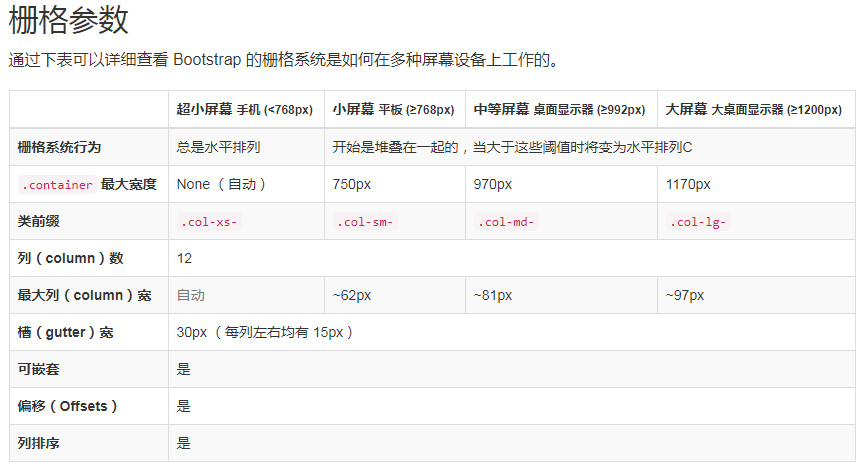

# 响应式布局+boostrap框架介绍

## 核心知识点

- 媒体查询
- boostrap框架
- 栅格系统

## 学习目标

- 能够掌握媒体查询基本语法
- 能够使用媒体查询完成微金所案例
- 能够使用boostrap框架中的基本样式
- 能够使用栅格系统完成阿里百秀案例

## 媒体查询

- 概念

  > ```css
  > 媒体查询可以让我们根据设备显示器的特性（如视口宽度、屏幕比例、设备方向：横向或纵向）为其设定CSS样式，媒体查询由媒体类型和一个或多个检测媒体特性的条件表达式组成。媒体查询中可用于检测的媒体特性有 width 、 height 和 color （等）。使用媒体查询，可以在不改变页面内容的情况下，为特定的一些输出设备定制显示效果。
  > ```

- 组成

  - 媒体类型
    - all  (所有的设备)
    - print (打印设备)
    - screen(电脑屏幕,平板电脑),智能手机
  - 媒体特性
    - width 
    - height
    - max-width / max-height 
    - min-width / min-width
    - orientation: portrait (竖屏模式肖像)  | landscape (横屏模式全景)
  - 语法关键字
    - and  可以将多个媒体特性链接到一块,相当于且
    - only   指定某个特定的媒体类型, 可以省略

- 语法

  ```css
  @media only screen and (width: 320px) {
       css代码
  }
  ```

- 设备划分

  - 超小屏幕  手机 (<768px)

    ```css
    @media only screen and (min-width: 320px) and (max-width: 767px) {}
    ```

  - 小屏幕 平板 (≥768px)

    ```css
    @media only screen and (min-width: 768px) and (max-width: 991px) {}
    ```

  - 中等屏幕 桌面显示器 (≥992px) 

    ```css
    @media only screen and (min-width: 992px) and (max-width: 1199px) {}
    ```

  - 大屏幕 大桌面显示器 (≥1200px)

    ```css
    @media only screen and (min-width: 1200px) {}
    ```

## boostrap框架

- 介绍  <https://www.bootcss.com/>

  > Bootstrap 是最受欢迎的 HTML、CSS 和 JS 框架，用于开发响应式布局、移动设备优先的 WEB 项目。

- 起步

  1. 下载【下载后的框架就是一个css文件】

     - 生产环境下的Bootstrap 

       ```css
       编译并压缩后的 CSS文件。不包含文档和源码文件。
       ```

     - Bootstrap源码

       ```css
       没有压缩的CSS文件,包含文档和源码文件。
       ```

  2. 引用 【在网页中引用下载好的css文件】

     ```html
     <!DOCTYPE html>
     <html lang="zh-CN">
       <head>
         <meta charset="utf-8">
         <meta http-equiv="X-UA-Compatible" content="IE=edge">
         <meta name="viewport" content="width=device-width, initial-scale=1">
         <title>Bootstrap</title>
         <!-- 引用bootstrap css文件 -->
         <link href="css/bootstrap.min.css" rel="stylesheet">
       </head>
       <body>
         <h1>你好，世界！</h1>
       </body>
     </html>
     ```

  3. 框架中的全局样式

     1. 在框架中用来表示一号标题到六号标题

        .h1 -  .h6

     2. 在框架中要设置文字对齐方式可以使用如下类名

         text-left  | text-center  | text-right

     3. 在网页中表示超小文字的标签

        <small>文字</small>

        ```css
        <small>超小文字</small>
        
        或者使用类名
        
        <div  class="small">超小文字</div>	
        ```

     4. 字母大小写转化对应的类名

        text-uppercase  ---> 将小写字母都转化为大写字母

        text-lowercase  ---> 将大写字母转化为小写字母

        text-capitalize  ----> 将单词首字母转为大写

        注意：以上类名中使用都是   text-transform属性实现的

        ```css
        .text-lowercase {
          text-transform: lowercase;
        }
        .text-uppercase {
          text-transform: uppercase;
        }
        .text-capitalize {
          text-transform: capitalize;
        }
        ```

     5. 去掉列表前的默认样式

        ```css
        .list-unstyled
        ```

     6. 实现li一行显示添加类名

        ```css
        .list-inline
        ```

     7. 设置表格基本样式

        ```css
        .table
        
        .table-bordered    设置边框
        
        .table-hover    设置鼠标悬停时候的样式
        ```

        

  4. 栅格系统

     - 介绍

       > Bootstrap 提供了一套响应式、移动设备优先的流式栅格系统，随着屏幕或视口（viewport）尺寸的增加，系统会自动分为最多12列。它包含了易于使用的[预定义类](#grid-example-basic)，还有强大的[mixin 用于生成更具语义的布局](#grid-less)。

     - 作用：

       - 通过栅格系统就可以开发响应式布局
       - 将栅格系统对应的盒子分为12列实现的

     - 使用

       - 必须 放到类名叫`.container` （固定宽度）或 `.container-fluid` （100% 宽度）中

       - 栅格参数

         - col-xs-值 ： 代表在超小设备中（手机）

         - col-sm-值:   代表在小屏幕设置中（平板）

         - col-md-值：代表在中等设备中（PC设备）

         - col-lg-值:  代表的是在超大设备中

         - 备注栅格参数中的值取值范围是： 1- 12

           

         

