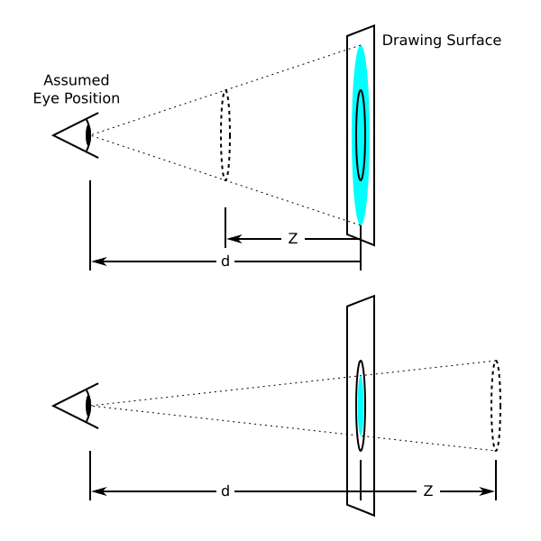

# 移动web第一天

## ☞核心知识点（案例演示）

#### 1. 2D转化及相关属性【重要】

#### 2. 3D转化及相关属性【重要】

#### 3. animation属性【重要】

## ☞每日目标

#### 1.使用2D转化中的属性实现元素放大，旋转效果

#### 2.使用3D转化实现立体导航效果

#### 3.使用animation实现钟表效果

## ☞2D转化[复合属性]

#### 1. 2D转化能够让我们干什么？

> ##### ◇2D转化可以让我们改变元素位置【位移】
>
> ##### ◇2D转化可以让页面中的元素旋转【旋转】
>
> ##### ◇2D转化可以改变页面中元素的大小【缩放】

#### 2. 2D转化位移

```css
语法：
   transform: translate(x, y);

备注：
   x 代表元素在水平方向的位移
   y 代表元素在垂直方向的位移

例如：
    div {
	    width: 200px;
        height: 200px;
        
        /*元素在水平方向向右移动200px，在垂直方向向下移动300px*/
        transform: translate(200px, 300px);
    }

总结：
	1.如果只设置了一个，那么代表元素只在水平方向发生位移
	2.可以设置负数，负数代表位移的相反方向
    3.可以设置百分比，相对元素的宽度或者高度
	4.位移没有让元素脱标


☞扩展：
位移的使用小技巧：可以让绝对定位的元素居中显示
	 position: absolute;
	 left: 50%;
	 top: 50%;
	 transform: translate(-50%, -50%);
```

#### 3. 2D转化旋转

```css
语法：
	transform: rotate(角度)；

备注：
	角度的单位是以 deg 为单位的。 如： 30deg [30度]

例如：
    div {
	   width: 200px;
       height: 200px;
       transform: rotate(30deg)；
    }	 

总结：
	1. 正数代表元素顺时针旋转
    2. 负数代表元素逆时针旋转
	3. 默认是绕着元素中心位置旋转
	4. 改变旋转中心位置通过 transform-origin 属性设置，取值为： left | right | top | bottom | cneter
	   例如：
        div {
		   width: 200px;
           height: 200px;
           transform-origin: left top;
           transform: rotate(30deg);
        }
```

#### 4. 2D转化缩放

```css
语法：
   transform: scale(width, height);

备注：
	1. 第一个值width表示元素宽度的倍数【不能设置负数】
	2. 第二个值height表示元素高度的倍数【不能设置负数】

例如：
    div {
        width: 200px;
        height: 200px;
        /*元素宽度是原来的2倍，高度是原来的3倍*/
        transform: scale(2, 3);
    }
总结：
	1. 如果设置一个值，代表宽度和高度同时放大或缩小相应的倍数
	2. 如果设置的值大于1，表示放大
	3. 如果设置的值大于0,小于1,表示缩小
    4. 如果设置的值等于1，表示大小不变
    5. 如果设置的值等于0，表示宽度或高度为0
```

#### 5. 2D转化注意事项

```css
1. 如果设置多个属性，要使用复合属性的写法
   transform: translate()  rotate()  scale()
```

## ☞3D转化【复合属性】

#### 1. 3D坐标系介绍


```css
 左手法则表示3D坐标系：	
 	1. 大拇指指向的方向就是 X 轴的正方向
	2. 中指指向的方向就是 Y 轴的正方向
	3. 食指指向的方向就是  Z 轴的正方向
```

#### 2. 3D转化位移

#####  -  沿着X轴位移（水平位移）

```css
语法：
	transform: translateX(值);

例如：
    div {
		width: 200px;
        height: 200px;
        background-color: red;
        transform: translateX(200px);
    }

总结：
	1. translateX代表元素沿着水平方向位移
	2. 正数代表水平向右移动
	3. 负数代表水平向左移动
	4. 可以设置百分比，相对当前元素自身的宽度
```

##### -  沿着Y轴位移 

```css
语法：
  transform: translateY(值);

例如：
	 div {
		width: 200px;
        height: 200px;
        background-color: red;
        transform: translateY(200px);
    }
总结：
	1.translateY 代表元素沿着垂直方向位移
	2.正数代表垂直向下移动
	3.负数代表垂直向上移动
	4.可以设置百分比，相对元素自身的高度
```

##### -  沿着Z轴位移

```css
语法：
   transform: translateZ(值);

例如：
    body {
        /*透视*/
		perspective: 1000px;
    }
	div {
		width: 200px;
        height: 200px;
        background-color: red;
        transform: translateZ(200px);
    }

总结：
	1. transform: translateZ 代表沿着Z轴移动
	2. 正数朝向我们移动
	3. 负数背向我们移动
	4. 不能设置百分比
```

#### 3. 透视perspective介绍



```css
作用： 网页中实现近大远小效果的属性

设置方式： 给设置了transform属性元素的父元素设置

取值范围： 推荐 600 - 1000 之间
```

#### 4. 3D转化旋转

##### - 沿着X轴旋转

```css
语法：
   transform: rotateX(值)

备注：
	1. rotateX中的值的单位表示角度，使用deg表示

例如：
    div {
		width: 200px;
        height: 200px;
        border: 1px solid red;
        transform: rotateX(30deg);
    }
总结：
	1. rotateX 代表元素绕着X轴旋转
	2. 可以设置正数或负数
	3. 通过transform-origin修改旋转轴的位置
```


##### - 沿着Y轴旋转

```css
语法：
   transform: rotateY(值)

备注：
	1. rotateY中的值的单位表示角度，使用deg表示

例如：
    div {
		width: 200px;
        height: 200px;
        border: 1px solid red;
        transform: rotateY(30deg);
    }

总结：
	1. rotateY 代表元素绕着Y轴旋转
	2. 可以设置正数或负数
```


##### - 沿着Z轴旋转

```css
语法：
   transform: rotateZ(值)

备注：
	1. rotateZ中的值的单位表示角度，使用deg表示

例如：
    div {
		width: 200px;
        height: 200px;
        border: 1px solid red;
        transform: rotateZ(30deg);
    }

总结：
	1. rotateZ 代表元素绕着Z轴旋转
	2. 可以设置正数或负数
	3. 通过transform-origin修改旋转轴的位置
```


#### 5.  3D旋转轴的改变

```css
☞ 2D旋转，主要元素是绕着点在旋转，所以在2d转化中通过transform-origin改变的是旋转圆点的位置

☞ 3D旋转，主要元素是绕着轴在旋转，所以3d转化中也是通过transform-origin改变的是旋转轴的位置
```

#### 6.  3D转化缩放

##### - 沿着X轴缩放

```css
语法：	
  transform: scaleX(值);

备注：
  1. scaleX中的值代表的是倍数，倍数是相对当前元素的宽度，不需要设置单位
  2. 不能设置负数
例如：
    div {
		width: 200px;
        height: 200px;
        /*元素最后的宽度是400，是在原来200宽度的基础上扩大了2倍*/
        transform: scaleX(2);
    }

总结：	
	1. scaleX 代表的是元素宽度扩大或缩小对应的倍数
	2. 大于1，代表放大倍数
	3. 大于0小于1,代表缩小倍数
	4. 等于1，大小不变
	5. 等于0，宽度为0
```

##### - 沿着Y轴缩放

```css
语法：	
  transform: scaleY(值);

备注：
  1. scaleY中的值代表的是倍数，不需要设置单位
  2. 不能设置负数
例如：
    div {
		width: 200px;
        height: 200px;
        /*元素最后的高度是400，是在原来200高度的基础上扩大了2倍*/
        transform: scaleY(2);
    }
总结：	
	1. scaleY 代表的是元素高度扩大或缩小对应的倍数
	2. 大于1，代表放大倍数
	3. 大于0小于1,代表缩小倍数
	4. 等于1，大小不变
	5. 等于0，宽度为0
```

##### - 将平面图形转化为立体图形

```css
transform-style: preserve-3d;
设置了该属性后，不需要再给元素设置透视的属性了。
```

## ☞ animation属性

```css
animation:
	1. 动画的执行，不需要有用户的动作
	2. animation动画的执行次数，是我们可以人为的控制的

transition:
	1. transition动画的执行，需要有用户动作
	2. transition动画的执行次数，依赖于用户的动作是否在进行【有用户的动作就执行，没有就结束】
```

```css
语法：

@keyframes 动画序列名称 {
  from {
      开始状态
  }  
  to {
      结束状态
  }
}

或者

@keyframes 动画序列名称 {
  0%{
      开始状态
  }  
  100%{
      结束状态
  }
}

☞步骤：
	1。 定义动画集
	2。 通过animation属性去调用执行动画
```

| 属性                      | 描述                                                         |
| :------------------------ | :----------------------------------------------------------- |
| @keyframes                | 定义动画                                                     |
| animation-name            | 规定 @keyframes 动画的名称。                                 |
| animation-duration        | 规定动画完成一个周期所花费的时间。                           |
| animation-timing-function | 规定动画的速度曲线。默认是 "ease"。                          |
| animation-delay           | 规定动画何时开始。默认是 0。                                 |
| animation-iteration-count | 规定动画被播放的次数。默认是 1。还有 infinite                |
| animation-direction       | 动画是否在下一周期逆向地播放。默认是 "normal"，alternate逆播放 |
| animation-play-state      | 规定动画是否正在运行或暂停。默认是 "running"。还有“paused”   |
| animation-fill-mode       | 规定动画结束后状态，保持 forwards 回到起始 backwards         |
| animation                 | 所有动画属性的简写属性                                       |

